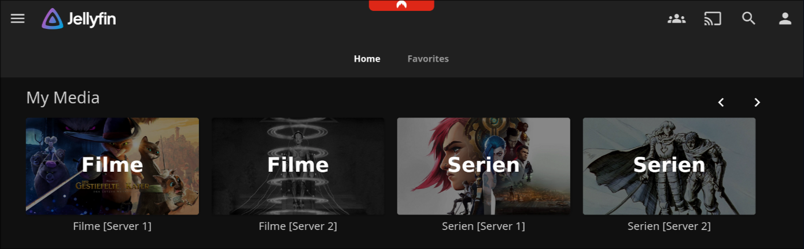
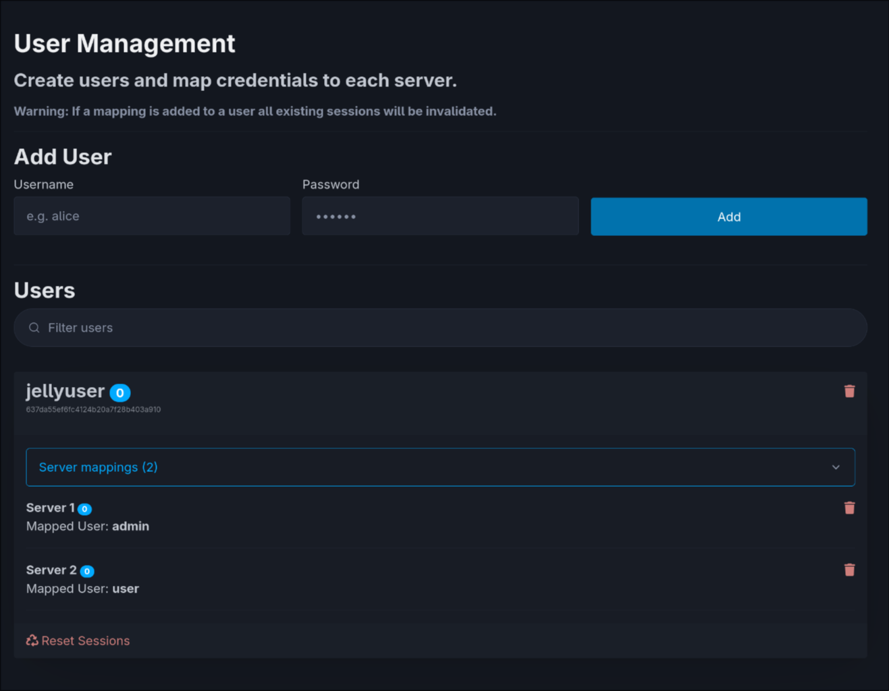

<h1 align="center">Jellyswarrm</h1>

<h3 align="center">Many servers. Single experience.</h3>

<p align="center">

<br/>
<br/>
<a href="https://opensource.org/licenses/MIT">

</a>
<a href="https://github.com/LLukas22/Jellyswarrm/releases">

</a>
</p>

Jellyswarrm is a reverse proxy that lets you combine multiple Jellyfin servers into one place. If you’ve got libraries spread across different locations or just want everything together, Jellyswarrm makes it easy to access all your media from a single interface.

---

<p align="center">
  <!-- Full-width library view -->
  
</p>

<p align="center">
  <!-- Side-by-side smaller views, same height -->
  
  
</p>

## Features

> [!WARNING]
> Jellyswarrm is still in **early development**. It works, but some features are incomplete or missing. If you run into issues, please report them on the [GitHub Issues page](https://github.com/LLukas22/Jellyswarrm/issues).

### ✅ Working

* **Unified Library Access** – Browse media from multiple Jellyfin servers in one place.
* **Direct Playback** – Play content straight from the original server without extra overhead.
* **User Mapping** – Link accounts across servers for a consistent user experience.
* **API Compatibility** – Appears as a normal Jellyfin server, so existing apps and tools still work.

### ⚠️ In Progress

* **Websocket Support** – Needed for real-time features like SyncPlay (not fully reliable yet).
* **Audio Streaming** – May not function correctly (still untested in many cases).
* **Automatic Bitrate Adjustment** – Stream quality based on network conditions isn’t supported yet.

### 🚫 Not Planned

* **Admin Functions** – Server administration (user management, settings, etc.) won’t be supported through Jellyswarrm.

---

## Deployment

The easiest way to run Jellyswarrm is with the prebuilt [Docker images](https://github.com/LLukas22?tab=packages&repo_name=Jellyswarrm).
Here’s a minimal `docker-compose.yml` example to get started:

```yaml
services:
  jellyswarrm:
    image: ghcr.io/llukas22/jellyswarrm:latest
    container_name: jellyswarrm
    restart: unless-stopped
    ports:
      - 3000:3000
    volumes:
      - ./data:/app/data
    environment:
      - JELLYSWARRM_USERNAME=admin
      - JELLYSWARRM_PASSWORD=jellyswarrm # ⚠️ Change this in production!
```

Once the container is running, open:

* **Web UI (setup & management):** `http://[JELLYSWARRM_HOST]:[JELLYSWARRM_PORT]/ui`
  – Log in with the username and password you set in the environment variables.
  – From here, you can add your Jellyfin servers and configure user mappings.

* **Bundled Jellyfin Web Client:** `http://[JELLYSWARRM_HOST]:[JELLYSWARRM_PORT]`

For advanced configuration options, check out the [ui](./docs/ui.md) and [configuration](./docs/config.md) documentation.

---


## Local Development
### Getting Started
To get started with development, you'll need to clone the repository along with its submodules. This ensures you have all the necessary components for a complete build:

```bash
git clone --recurse-submodules https://github.com/LLukas22/Jellyswarrm.git
```

If you've already cloned the repository, you can initialize the submodules separately:

```bash
git submodule init
git submodule update
```


<details open>
<summary><strong>Docker</strong></summary>

The quickest way to get Jellyswarrm up and running is with Docker. Simply use the provided [docker-compose](./docker-compose.yml) configuration:

```bash
docker compose up -d
```

This will build and start the application with all necessary dependencies, perfect for both development and production deployments.
</details>


<details>
<summary><strong>Native Build</strong></summary>

For a native development setup, ensure you have both Rust and Node.js installed on your system. 

First, install the UI dependencies. You can use the convenient VS Code task `Install UI Dependencies` from the tasks.json file, or run it manually:

```bash
cd ui
npm install
cd ..
```

Once the dependencies are installed, build the entire project with:

```bash
cargo build --release
```

The build process is streamlined thanks to the included [`build.rs`](./crates/jellyswarrm-proxy/build.rs) script, which automatically compiles the web UI and embeds it into the final binary for a truly self-contained application.
</details>

## FAQ  

1. **Why not just add multiple servers directly in the Jellyfin app?**  
   Some Jellyfin apps do support multiple servers, but switching between them can be inconvenient. Jellyswarrm brings everything together in one place and also merges features like *Next Up* and *Recently Added* across all servers. This way, you can easily see what’s new in your own libraries or what your friends have added.  

2. **Will Jellyswarrm work with my existing Jellyfin apps?**  
   Most likely! Jellyswarrm presents itself as a standard Jellyfin server, so most clients should work out of the box. That said, not every Jellyfin client has been tested, so a few may have issues.  

3. **Why use Jellyswarrm instead of mounting a remote library via e.g. SMB?**  
   Jellyswarrm is built to **connect your servers with your friends’ servers** across different networks. Setting up SMB in these cases can be complicated, and performance is often worse. With Jellyswarrm, content is streamed directly from the original server, so all the heavy lifting (like transcoding) happens where the media actually lives.  
