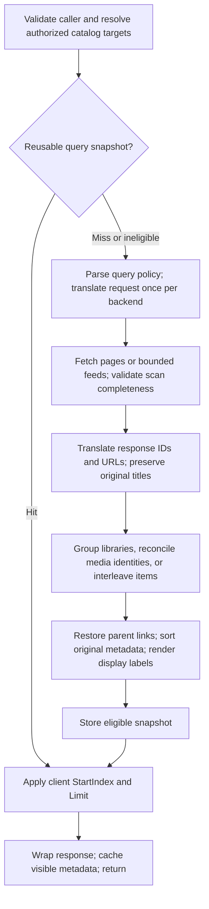

# Federated media pipeline

- Pageable queries reuse a 60-second, 64-MiB-weighted cache, scoped to viewer,
  token, query, backend sessions/targets, and display configuration. Concurrent
  identical builds coalesce; `Limit=0` uses the same snapshot. Library roots and
  latest/suggestions bypass it; the latter remain bounded feeds.
- Each backend scan advances by received counts and validates totals, offsets,
  response shape, and unique IDs. It stops after 100,000 items, 10,000 pages, or
  the configured timeout (clamped to 1–300 seconds). Incomplete/failing sources
  return an error; they never publish a partial page, cache it, or prune sightings.
  Bounded feeds are additive observations, never complete inventories.
- Field sorts use a final ID tiebreaker. Random queries scan in name order and
  shuffle once per snapshot; Next Up and backend-only rankings retain upstream
  order. Snapshot consistency lasts until expiry/eviction; upstream APIs provide
  no revision token to detect every same-count catalog edit during a scan.
- Library roots translate raw members while grouping. Media reconciliation
  consumes translated IDs and records display decisions without changing titles.
  Numbered episodes include their end index: identical ranges can be versions,
  including multiple copies on one server; combined and standalone episodes
  stay distinct. Other same-server ambiguities remain visible.
