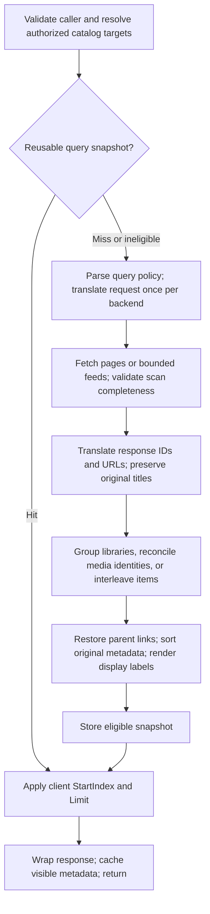

# Federated media pipeline

- Pageable queries reuse a 60-second, 64-MiB-weighted cache, scoped to viewer,
  token, query, backend sessions/targets, and display configuration. Concurrent
  identical builds coalesce; `Limit=0` uses the same snapshot. Library roots,
  Resume, Next Up, and latest/suggestions bypass it; latest/suggestions remain
  bounded feeds. Successful proxied mutations advance the viewer's cache
  revision, including when an older snapshot build is still in flight.
- Each backend scan advances by received counts and validates totals, offsets,
  response shape, and unique IDs. The configured timeout (clamped to 1–300
  seconds) applies to each page. Counted catalogs scan to their validated total;
  uncounted sources retain defensive limits of 100,000 items and 10,000 pages.
  Incomplete/failing sources are excluded while healthy sources remain available.
  If every source fails, the request returns 503. Counts describe the available
  result set. Degraded responses are not cached, so recovery is retried promptly.
  Only fully scanned sources can replace their own sightings, and missing sources
  are pruned only when every authorized target was available and succeeded.
  Authorization scope includes offline backends independently of active sessions.
  Bounded feeds are additive observations, never complete inventories.
- Field sorts use a final ID tiebreaker. Random queries scan in name order and
  shuffle once per snapshot; Next Up and backend-only rankings retain upstream
  order. Snapshot consistency lasts until expiry/eviction; upstream APIs provide
  no revision token to detect every same-count catalog edit during a scan.
- Library roots translate raw members while grouping. Media reconciliation
  consumes translated IDs and records display decisions without changing titles.
  Numbered-child identity and parent links prefer the current catalog's parent
  groups, so partial search/latest memberships cannot veto a fuller inventory.
  Numbered episodes include their end index: identical ranges can be versions,
  including multiple copies on one server; combined and standalone episodes
  stay distinct. Playback sessions retain the exact selected backend item for
  streaming and start/progress/stopped reports. Other same-server ambiguities
  remain visible.
