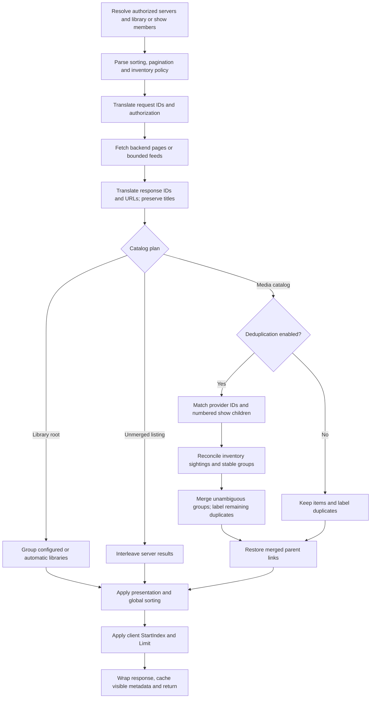

# Federated media pipeline

```mermaid
flowchart TD
    A[Resolve authorized servers and library or show members]
    A --> B[Parse sorting, pagination and inventory policy]
    B --> C[Translate request IDs and authorization]
    C --> D[Fetch backend pages or bounded feeds]
    D --> E[Translate response IDs and URLs; preserve titles]
    E --> F{Catalog plan}
    F -->|Library root| G[Group configured or automatic libraries]
    F -->|Unmerged listing| H[Interleave server results]
    F -->|Media catalog| I{Deduplication enabled?}
    I -->|Yes| J[Match provider IDs and numbered show children]
    J --> K[Reconcile inventory sightings and stable groups]
    K --> L[Merge unambiguous groups; label remaining duplicates]
    I -->|No| M[Keep items and label duplicates]
    L --> N[Restore merged parent links]
    M --> N
    G --> O[Apply presentation and global sorting]
    H --> O
    N --> O
    O --> P[Apply client StartIndex and Limit]
    P --> Q[Wrap response, cache visible metadata and return]
```

Pageable catalogs are scanned before client pagination; latest/suggestions remain bounded feeds.
