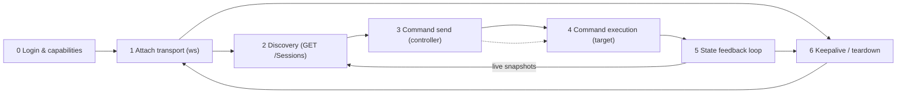
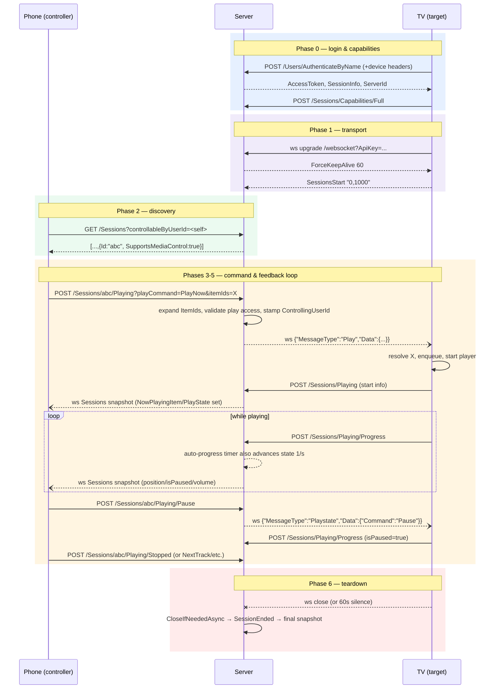

# Sessions / Remote Control Module

Specification for implementing **remote control of playback sessions** ("cast" a playing session between devices) in Jellyswarrm. This module does not exist yet; this document captures how upstream Jellyfin implements it so we can build an API-compatible equivalent (and eventually fuse multiple upstream servers into one view, which is the hard part).

## Pinned source revision

All upstream behavior below was read from, and every link points into, this exact revision of [jellyfin/jellyfin](https://github.com/jellyfin/jellyfin):

| | |
|---|---|
| Repo | `https://github.com/jellyfin/jellyfin` |
| Commit | `1cc490fb190d01c34c3c7bed0f9f8df6e122ade0` |
| Date | `2026-08-26T13:52:43+00:00` |
| Branch | `master` |

To reproduce locally:

```bash
git clone https://github.com/jellyfin/jellyfin
cd jellyfin && git checkout 1cc490fb190d01c34c3c7bed0f9f8df6e122ade0
```

Links use `#L<line>` anchors against that commit, e.g.
[SessionManager.cs L1992](https://github.com/jellyfin/jellyfin/blob/1cc490fb190d01c34c3c7bed0f9f8df6e122ade0/Emby.Server.Implementations/Session/SessionManager.cs#L1992).

> If a link ever goes stale, re-pin by re-auditing against newest master and updating this header (bump both tables).

Key source files (GitHub links):

| Concern | Files |
|---|---|
| REST controllers | [SessionController.cs](https://github.com/jellyfin/jellyfin/blob/1cc490fb190d01c34c3c7bed0f9f8df6e122ade0/Jellyfin.Api/Controllers/SessionController.cs) · [PlaystateController.cs](https://github.com/jellyfin/jellyfin/blob/1cc490fb190d01c34c3c7bed0f9f8df6e122ade0/Jellyfin.Api/Controllers/PlaystateController.cs) |
| Session manager (state, authz, delivery) | [SessionManager.cs](https://github.com/jellyfin/jellyfin/blob/1cc490fb190d01c34c3c7bed0f9f8df6e122ade0/Emby.Server.Implementations/Session/SessionManager.cs) |
| Per-session websocket bridge | [WebSocketController.cs](https://github.com/jellyfin/jellyfin/blob/1cc490fb190d01c34c3c7bed0f9f8df6e122ade0/Emby.Server.Implementations/Session/WebSocketController.cs) (implements `ISessionController`) |
| Websocket attach + keepalive | [SessionWebSocketListener.cs](https://github.com/jellyfin/jellyfin/blob/1cc490fb190d01c34c3c7bed0f9f8df6e122ade0/Emby.Server.Implementations/Session/SessionWebSocketListener.cs) |
| Periodic push streams | [BasePeriodicWebSocketListener.cs](https://github.com/jellyfin/jellyfin/blob/1cc490fb190d01c34c3c7bed0f9f8df6e122ade0/MediaBrowser.Controller/Net/BasePeriodicWebSocketListener.cs) · [SessionInfoWebSocketListener.cs](https://github.com/jellyfin/jellyfin/blob/1cc490fb190d01c34c3c7bed0f9f8df6e122ade0/Jellyfin.Api/WebSocketListeners/SessionInfoWebSocketListener.cs) |
| Caller-session resolution | [RequestHelpers.cs](https://github.com/jellyfin/jellyfin/blob/1cc490fb190d01c34c3c7bed0f9f8df6e122ade0/Jellyfin.Api/Helpers/RequestHelpers.cs) (`GetSession` / `GetSessionId` / `GetUserId`) |
| Auth context / token parsing | [AuthorizationContext.cs](https://github.com/jellyfin/jellyfin/blob/1cc490fb190d01c34c3c7bed0f9f8df6e122ade0/Jellyfin.Server.Implementations/Security/AuthorizationContext.cs) |
| JSON settings | [JsonDefaults.cs](https://github.com/jellyfin/jellyfin/blob/1cc490fb190d01c34c3c7bed0f9f8df6e122ade0/src/Jellyfin.Extensions/Json/JsonDefaults.cs) |
| DTOs & enums | [MediaBrowser.Model/Dto/SessionInfoDto.cs](https://github.com/jellyfin/jellyfin/blob/1cc490fb190d01c34c3c7bed0f9f8df6e122ade0/MediaBrowser.Model/Dto/SessionInfoDto.cs) · [MediaBrowser.Model/Session/](https://github.com/jellyfin/jellyfin/tree/1cc490fb190d01c34c3c7bed0f9f8df6e122ade0/MediaBrowser.Model/Session) · [SessionInfo.cs](https://github.com/jellyfin/jellyfin/blob/1cc490fb190d01c34c3c7bed0f9f8df6e122ade0/MediaBrowser.Controller/Session/SessionInfo.cs) |

---

## What this feature is

Any authenticated client can:

1. **List** live sessions (`GET /Sessions`) and see each device's play state (item, position, paused, volume...).
2. **Send commands** to another session: play now / next / last, pause, seek, volume/mute, display message, browse-to-item, remote-key presses (`POST /Sessions/{sessionId}/...`).
3. **Receive commands**: while a session has an open websocket it is controllable; incoming commands arrive as websocket messages (`Play`, `Playstate`, `GeneralCommand`) and the client executes them locally.
4. **Report its own state back** over plain HTTP (`POST /Sessions/Playing`, `/Playing/Progress`, `/Playing/Ping`, `/Playing/Stopped`), which the server records and broadcasts to everyone subscribed via the `Sessions` websocket stream.

So "casting" in Jellyfin = one session pushes media/playback control to another session through the server relay. There is **no direct peer-to-peer channel**; everything flows through the session manager and websockets.

Terminology:

- **Session** – one logical client instance keyed by `(Client name, DeviceId)`. A session can own multiple transport connections (websockets) but has one identity.
- **Controlling session** – the sender of a command; always derived server-side from the caller's auth context, never passed as a parameter.
- **Target session** – `{sessionId}` in the URL; must advertise `SupportsRemoteControl` and actually receive commands only while `SupportsMediaControl` holds (open websocket).

## The remote-control lifecycle, end to end

Six phases; each cites its implementation.



### Phase 0 — Login, device registration, capability advertisement

1. `POST /Users/AuthenticateByName` with body `{Username, Pw}` plus device identity headers. Password check succeeds → [AuthenticateNewSessionInternal → LogSessionActivity](https://github.com/jellyfin/jellyfin/blob/1cc490fb190d01c34c3c7bed0f9f8df6e122ade0/Emby.Server.Implementations/Session/SessionManager.cs#L1624): a `Device` row (user ↔ deviceId ↔ fresh random `AccessToken`) is created and a [SessionInfo](https://github.com/jellyfin/jellyfin/blob/1cc490fb190d01c34c3c7bed0f9f8df6e122ade0/MediaBrowser.Controller/Session/SessionInfo.cs) object materializes. Response carries `AccessToken`, `SessionInfo`, `ServerId`.
2. The client immediately declares what it can do: `POST /Sessions/Capabilities/Full` ([PostFullCapabilities](https://github.com/jellyfin/jellyfin/blob/1cc490fb190d01c34c3c7bed0f9f8df6e122ade0/Jellyfin.Api/Controllers/SessionController.cs#L377)) or the query-string form [`POST /Sessions/Capabilities`](https://github.com/jellyfin/jellyfin/blob/1cc490fb190d01c34c3c7bed0f9f8df6e122ade0/Jellyfin.Api/Controllers/SessionController.cs#L345). Body = `ClientCapabilities {PlayableMediaTypes, SupportedCommands[], SupportsMediaControl, SupportsPersistentIdentifier}`. Stored via [ReportCapabilities](https://github.com/jellyfin/jellyfin/blob/1cc490fb190d01c34c3c7bed0f9f8df6e122ade0/Emby.Server.Implementations/Session/SessionManager.cs#L1808) on the *session* **and persisted** on the *device* (so future sessions inherit them); fires `CapabilitiesChanged`.
   - `SupportsMediaControl` here is only a hint ("this client could be driven"); the live flag computed during Phase 1 overrides it for delivery feasibility.
3. Every subsequent authenticated REST call keeps the session warm: [`RequestHelpers.GetSession`](https://github.com/jellyfin/jellyfin/blob/1cc490fb190d01c34c3c7bed0f9f8df6e122ade0/Jellyfin.Api/Helpers/RequestHelpers.cs#L123) → [LogSessionActivity](https://github.com/jellyfin/jellyfin/blob/1cc490fb190d01c34c3c7bed0f9f8df6e122ade0/Emby.Server.Implementations/Session/SessionManager.cs#L244) updates `LastActivityDate` and fires `SessionActivity` throttled to >10 s.

### Phase 1 — Registering a transport (websocket)

1. Client opens HTTP upgrade at `/websocket`. Authentication happens **before** accept (`WebSocketManager.WebSocketRequestHandler` → `IAuthService.Authenticate`); the token is taken from, in priority order ([AuthorizationContext.cs L73–111](https://github.com/jellyfin/jellyfin/blob/1cc490fb190d01c34c3c7bed0f9f8df6e122ade0/Jellyfin.Server.Implementations/Security/AuthorizationContext.cs#L73)):
   1. `Token` field inside the `Authorization: MediaBrowser ...` header,
   2. legacy headers `X-Emby-Token` / `X-MediaBrowser-Token` (only when `EnableLegacyAuthorization`),
   3. query string `?ApiKey=` (always accepted) or `?api_key=` (legacy).

   Browsers usually fall back to `?ApiKey=` since custom headers are impossible on browser websocket upgrades.
2. [`SessionWebSocketListener.ProcessWebSocketConnectedAsync`](https://github.com/jellyfin/jellyfin/blob/1cc490fb190d01c34c3c7bed0f9f8df6e122ade0/Emby.Server.Implementations/Session/SessionWebSocketListener.cs#L114) resolves (or lazily creates) the session from those same identity fields, then attaches the connection to a per-session [`WebSocketController`](https://github.com/jellyfin/jellyfin/blob/1cc490fb190d01c34c3c7bed0f9f8df6e122ade0/Emby.Server.Implementations/Session/WebSocketController.cs#L62) — multiple concurrent sockets per session are fine.
3. Server sends **`ForceKeepAlive` with `Data: 60`** (seconds) right away ([SendForceKeepAlive](https://github.com/jellyfin/jellyfin/blob/1cc490fb190d01c34c3c7bed0f9f8df6e122ade0/Emby.Server.Implementations/Session/SessionWebSocketListener.cs#L274)).
4. From this moment the session's live flags change: [`SupportsMediaControl == HasOpenSockets`](https://github.com/jellyfin/jellyfin/blob/1cc490fb190d01c34c3c7bed0f9f8df6e122ade0/Emby.Server.Implementations/Session/WebSocketController.cs#L57) — i.e. exactly "at least one open websocket" — which surfaces in the session list and decides whether controllers may target it.
5. Optionally the client subscribes to live session snapshots: inbound `{"MessageType":"SessionsStart","Data":"0,1000"}` — Data parses as `"dueTimeMs,periodMs"` ([Start, BasePeriodicWebSocketListener L121](https://github.com/jellyfin/jellyfin/blob/1cc490fb190d01c34c3c7bed0f9f8df6e122ade0/MediaBrowser.Controller/Net/BasePeriodicWebSocketListener.cs#L121)). Unsubscribe with `SessionsStop`.

### Phase 2 — Discovery (controller picks a target)

`GET /Sessions?controllableByUserId=<uid>&activeWithinSeconds=<n>` ([GetSessions endpoint](https://github.com/jellyfin/jellyfin/blob/1cc490fb190d01c34c3c7bed0f9f8df6e122ade0/Jellyfin.Api/Controllers/SessionController.cs#L52)):

- `controllableByUserId` is clamped first: a non-admin requesting someone else's id is rejected outright; omitting it falls back to the caller ([RequestHelpers.GetUserId L67–79](https://github.com/jellyfin/jellyfin/blob/1cc490fb190d01c34c3c7bed0f9f8df6e122ade0/Jellyfin.Api/Helpers/RequestHelpers.cs#L67)).
- Then the filter pipeline in [SessionManager.GetSessions L1992–2092](https://github.com/jellyfin/jellyfin/blob/1cc490fb190d01c34c3c7bed0f9f8df6e122ade0/Emby.Server.Implementations/Session/SessionManager.cs#L1992):
  1. `deviceId` filter if given;
  2. caller identity resolved (API key ⇒ full visibility);
  3. when `controllableByUserId` was supplied: keep only sessions with `SupportsRemoteControl`; drop anonymous sessions unless the controlled user has `EnableSharedDeviceControl`; drop sessions outside the caller's user-relationship unless the caller has `EnableRemoteControlOfOtherUsers`; finally enforce per-device access via `DeviceManager.CanAccessDevice` (admin / `EnableAllDevices` pass, else target device id must be in the caller's `EnabledDevices` preference; non-persistent devices always pass);
  4. without `controllableByUserId`, non-admins only see their own sessions (primary or additional users);
  5. non-admin responses additionally have `TranscodingInfo.HardwareAccelerationType` masked.
- Defaults: `EnableRemoteControlOfOtherUsers = false` for regular users ([UserEntityExtensions L209](https://github.com/jellyfin/jellyfin/blob/1cc490fb190d01c34c3c7bed0f9f8df6e122ade0/Jellyfin.Data/UserEntityExtensions.cs#L209)); the auto-created initial user gets it enabled ([UserManager.cs L767](https://github.com/jellyfin/jellyfin/blob/1cc490fb190d01c34c3c7bed0f9f8df6e122ade0/Jellyfin.Server.Implementations/Users/UserManager.cs#L767)); `EnableSharedDeviceControl = true`.
- Response = array of [SessionInfoDto](https://github.com/jellyfin/jellyfin/blob/1cc490fb190d01c34c3c7bed0f9f8df6e122ade0/MediaBrowser.Model/Dto/SessionInfoDto.cs). Clients render entries with `SupportsMediaControl=true` as controllable targets and keep them updated via the Phase-5 push stream instead of polling.

### Phase 3 — Controller sends a command

One REST route per family, all funneling into `SessionManager.Send*` then out over the target's websocket:

```
POST /Sessions/{target}/...
  → controller resolves CONTROLLING session from caller token (GetSessionId)
  → SessionManager.Send{Play,Playstate,General}Command(controllingId, targetId, payload)
      1. locate target session
      2. AssertCanControl(...)            ← see caveat below
      3. decorate payload.ControllingUserId
      4. SendMessageToSession → foreach ISessionController → WebSocketController.SendMessage
           pick ONE open socket (most recently active) and emit frame
```

Routes ([SessionController.cs](https://github.com/jellyfin/jellyfin/blob/1cc490fb190d01c34c3c7bed0f9f8df6e122ade0/Jellyfin.Api/Controllers/SessionController.cs)):

| Route | Line | Payload emitted to target |
|---|---|---|
| `POST /Sessions/{id}/Playing` | [L119](https://github.com/jellyfin/jellyfin/blob/1cc490fb190d01c34c3c7bed0f9f8df6e122ade0/Jellyfin.Api/Controllers/SessionController.cs#L119) | `Play` message carrying [`PlayRequest`](https://github.com/jellyfin/jellyfin/blob/1cc490fb190d01c34c3c7bed0f9f8df6e122ade0/MediaBrowser.Model/Session/PlayRequest.cs) |
| `POST /Sessions/{id}/Playing/{command}` | [L162](https://github.com/jellyfin/jellyfin/blob/1cc490fb190d01c34c3c7bed0f9f8df6e122ade0/Jellyfin.Api/Controllers/SessionController.cs#L162) | `Playstate` message carrying [`PlaystateRequest`](https://github.com/jellyfin/jellyfin/blob/1cc490fb190d01c34c3c7bed0f9f8df6e122ade0/MediaBrowser.Model/Session/PlaystateRequest.cs) |
| `POST /Sessions/{id}/System/{command}` | [L193](https://github.com/jellyfin/jellyfin/blob/1cc490fb190d01c34c3c7bed0f9f8df6e122ade0/Jellyfin.Api/Controllers/SessionController.cs#L193) | `GeneralCommand {Name: <command>}` |
| `POST /Sessions/{id}/Command/{command}` | [L219](https://github.com/jellyfin/jellyfin/blob/1cc490fb190d01c34c3c7bed0f9f8df6e122ade0/Jellyfin.Api/Controllers/SessionController.cs#L219) | `GeneralCommand {Name: <command>}` |
| `POST /Sessions/{id}/Command` | [L247](https://github.com/jellyfin/jellyfin/blob/1cc490fb190d01c34c3c7bed0f9f8df6e122ade0/Jellyfin.Api/Controllers/SessionController.cs#L247) | `GeneralCommand` verbatim from body; server overwrites `ControllingUserId` |
| `POST /Sessions/{id}/Message` | [L277](https://github.com/jellyfin/jellyfin/blob/1cc490fb190d01c34c3c7bed0f9f8df6e122ade0/Jellyfin.Api/Controllers/SessionController.cs#L277) | rewritten to `GeneralCommand {Name: DisplayMessage}` with `Text`/`TimeoutMs` arguments ([SendMessageCommand impl](https://github.com/jellyfin/jellyfin/blob/1cc490fb190d01c34c3c7bed0f9f8df6e122ade0/Emby.Server.Implementations/Session/SessionManager.cs#L1270)) |
| `POST /Sessions/{id}/Viewing` | [L80](https://github.com/jellyfin/jellyfin/blob/1cc490fb190d01c34c3c7bed0f9f8df6e122ade0/Jellyfin.Api/Controllers/SessionController.cs#L80) | rewritten to `GeneralCommand {Name: DisplayContent}` ([SendBrowseCommand](https://github.com/jellyfin/jellyfin/blob/1cc490fb190d01c34c3c7bed0f9f8df6e122ade0/Emby.Server.Implementations/Session/SessionManager.cs#L1504)) |
| `POST /Sessions/{id}/User/{userId}` add/remove | [L306](https://github.com/jellyfin/jellyfin/blob/1cc490fb190d01c34c3c7bed0f9f8df6e122ade0/Jellyfin.Api/Controllers/SessionController.cs#L306) / [L324](https://github.com/jellyfin/jellyfin/blob/1cc490fb190d01c34c3c7bed0f9f8df6e122ade0/Jellyfin.Api/Controllers/SessionController.cs#L324) | no message; mutates `AdditionalUsers` on the session (affects Phase-2 filters and whose resume data gets written in Phase 5) |

Server-side transformations worth copying exactly ([SendPlayCommand L1336](https://github.com/jellyfin/jellyfin/blob/1cc490fb190d01c34c3c7bed0f9f8df6e122ade0/Emby.Server.Implementations/Session/SessionManager.cs#L1336)):

- Item ids are expanded before emission: folders become their recursive non-folder children; `PlayInstantMix` swaps ids for the generated mix and rewrites itself to `PlayNow`; `PlayShuffle` shuffles and rewrites to `PlayNow`.
- Play access of the target's user is verified (error otherwise); `EnableNextEpisodeAutoPlay` appends remaining series episodes after a single-episode request.
- `SendMessageToSession` ([L1306](https://github.com/jellyfin/jellyfin/blob/1cc490fb190d01c34c3c7bed0f9f8df6e122ade0/Emby.Server.Implementations/Session/SessionManager.cs#L1306)) generates one fresh `MessageId` (GUID) per call; [`WebSocketController.SendMessage`](https://github.com/jellyfin/jellyfin/blob/1cc490fb190d01c34c3c7bed0f9f8df6e122ade0/Emby.Server.Implementations/Session/WebSocketController.cs#L98) delivers to the single most-recently-active open socket — not broadcast.
- If the target advertises `SupportsRemoteControl` but currently has no open socket, the send **silently completes**; nothing reaches any client. Controllers must therefore trust `SupportsMediaControl` from the list, not `SupportsRemoteControl`.

**Command-time authorization caveat:** [`AssertCanControl` L1540](https://github.com/jellyfin/jellyfin/blob/1cc490fb190d01c34c3c7bed0f9f8df6e122ade0/Emby.Server.Implementations/Session/SessionManager.cs#L1540) is effectively null-check-only in this revision, so knowing a session id suffices to POST commands. Security relies on the Phase-2 discovery filter. Reimplementations should keep the discovery filter **and** re-check `same user || EnableSharedDeviceControl || EnableRemoteControlOfOtherUsers || admin || api-key` inside every command handler.

### Phase 4 — Target receives & executes

The client-side contract (what stock clients such as jellyfin-web implement; the server just forwards):

| Incoming frame | Required client behavior |
|---|---|
| `Play` (`PlayRequest`) | Resolve `ItemIds` against its library, build queue honoring `StartPositionTicks`, `AudioStreamIndex`, `SubtitleStreamIndex`, `StartIndex`; interpretation depends on `PlayCommand`: append-and-jump (`PlayNext`), append (`PlayLast`), start immediately (`PlayNow`). Begin playback. Then report Phase-5 start. `ControllingUserId` may be shown ("cast by ..."). |
| `Playstate` (`PlaystateRequest`) | Apply `Command`: `Stop/Pause/Unpause/NextTrack/PreviousTrack/Rewind/FastForward` instantly, `Seek` to `SeekPositionTicks`. After applying, report progress/stopped in Phase 5 style. |
| `GeneralCommand` | Switch on `Name`; values come through `Arguments` (string map): volume-related commands set volume/mute, `SetAudioStreamIndex`/`SetSubtitleStreamIndex` switch tracks, `DisplayContent` navigates to the item, `DisplayMessage` shows a toast/dialog, directional keys press UI buttons, `SetRepeatMode`/`SetPlaybackOrder` mutate queue modes, etc. Unsupported names are ignored — clients advertise their subset via `SupportedCommands`. |

### Phase 5 — State feedback loop (target → server → other sessions)

Targets report through plain HTTP, bodies being [`PlaybackStartInfo`](https://github.com/jellyfin/jellyfin/blob/1cc490fb190d01c34c3c7bed0f9f8df6e122ade0/MediaBrowser.Model/Session/PlaybackStartInfo.cs)/[`PlaybackProgressInfo`](https://github.com/jellyfin/jellyfin/blob/1cc490fb190d01c34c3c7bed0f9f8df6e122ade0/MediaBrowser.Model/Session/PlaybackProgressInfo.cs)/[`PlaybackStopInfo`](https://github.com/jellyfin/jellyfin/blob/1cc490fb190d01c34c3c7bed0f9f8df6e122ade0/MediaBrowser.Model/Session/PlaybackStopInfo.cs) (the `SessionId` field is **overwritten** server-side with the caller's session):

| Route | Handler | Server effects |
|---|---|---|
| `POST /Sessions/Playing` | [ReportPlaybackStart L201](https://github.com/jellyfin/jellyfin/blob/1cc490fb190d01c34c3c7bed0f9f8df6e122ade0/Jellyfin.Api/Controllers/PlaystateController.cs#L201) → [OnPlaybackStart L762](https://github.com/jellyfin/jellyfin/blob/1cc490fb190d01c34c3c7bed0f9f8df6e122ade0/Emby.Server.Implementations/Session/SessionManager.cs#L762) | Sets `NowPlayingItem` + [PlayerStateInfo](https://github.com/jellyfin/jellyfin/blob/1cc490fb190d01c34c3c7bed0f9f8df6e122ade0/MediaBrowser.Model/Session/PlayerStateInfo.cs) ([UpdateNowPlayingItem L389](https://github.com/jellyfin/jellyfin/blob/1cc490fb190d01c34c3c7bed0f9f8df6e122ade0/Emby.Server.Implementations/Session/SessionManager.cs#L389)), stamps `LastPlaybackCheckIn`, bumps play-count user data, starts **server-side auto-progress**, fires `PlaybackStart`. |
| `POST /Sessions/Playing/Progress` | [L217](https://github.com/jellyfin/jellyfin/blob/1cc490fb190d01c34c3c7bed0f9f8df6e122ade0/Jellyfin.Api/Controllers/PlaystateController.cs#L217) → [OnPlaybackProgress(info, false) L894](https://github.com/jellyfin/jellyfin/blob/1cc490fb190d01c34c3c7bed0f9f8df6e122ade0/Emby.Server.Implementations/Session/SessionManager.cs#L894) | Updates position/pause/mute/volume/stream indexes + queue state; persists resume position and playback settings user data; fires `PlaybackProgress` (non-automated events force-broadcast). |
| `POST /Sessions/Playing/Ping` | [L233](https://github.com/jellyfin/jellyfin/blob/1cc490fb190d01c34c3c7bed0f9f8df6e122ade0/Jellyfin.Api/Controllers/PlaystateController.cs#L233) | ⚠️ NOT a session-state heartbeat: pings the **transcoding job manager** (`PingTranscodingJob(playSessionId)`) so an HLS/transcode job isn't reaped mid-viewing. No session mutation. |
| `POST /Sessions/Playing/Stopped` | [L247](https://github.com/jellyfin/jellyfin/blob/1cc490fb190d01c34c3c7bed0f9f8df6e122ade0/Jellyfin.Api/Controllers/PlaystateController.cs#L247) → [OnPlaybackStopped L1050](https://github.com/jellyfin/jellyfin/blob/1cc490fb190d01c34c3c7bed0f9f8df6e122ade0/Emby.Server.Implementations/Session/SessionManager.cs#L1050) | Kills matching transcode jobs, records played/resume position, clears now-playing state ([RemoveNowPlayingItem L466](https://github.com/jellyfin/jellyfin/blob/1cc490fb190d01c34c3c7bed0f9f8df6e122ade0/Emby.Server.Implementations/Session/SessionManager.cs#L466)), stops auto-progress, fires `PlaybackStopped`. |

Two subtleties that make remote displays feel alive:

- **Server-side auto-progress**: on start (and each manual check-in) the session arms a 1-second timer ([StartAutomaticProgress, SessionInfo.cs L383](https://github.com/jellyfin/jellyfin/blob/1cc490fb190d01c34c3c7bed0f9f8df6e122ade0/MediaBrowser.Controller/Session/SessionInfo.cs#L383)) that fabricates automated progress reports advancing `PositionTicks` by `10_000_000` ticks = 1 s (`ProgressIncrement` [L23](https://github.com/jellyfin/jellyfin/blob/1cc490fb190d01c34c3c7bed0f9f8df6e122ade0/MediaBrowser.Controller/Session/SessionInfo.cs#L23)), stopping at the item runtime or while paused ([OnProgressTimerCallback L406](https://github.com/jellyfin/jellyfin/blob/1cc490fb190d01c34c3c7bed0f9f8df6e122ade0/MediaBrowser.Controller/Session/SessionInfo.cs#L406)). Automated reports update session state but skip user-data persistence and only trickle into broadcasts.
- **Idle recovery**: a 5-minute timer ([CheckForIdlePlayback L636](https://github.com/jellyfin/jellyfin/blob/1cc490fb190d01c34c3c7bed0f9f8df6e122ade0/Emby.Server.Implementations/Session/SessionManager.cs#L636)) synthesizes `PlaybackStopped` at the last reported position for sessions playing-but-not-checking-in >5 min — so forgotten screens still resolve queue state.

Every event fans out to subscribers ([SessionInfoWebSocketListener](https://github.com/jellyfin/jellyfin/blob/1cc490fb190d01c34c3c7bed0f9f8df6e122ade0/Jellyfin.Api/WebSocketListeners/SessionInfoWebSocketListener.cs#L34)): payload = the **full array** of [SessionInfoDto](https://github.com/jellyfin/jellyfin/blob/1cc490fb190d01c34c3c7bed0f9f8df6e122ade0/MediaBrowser.Model/Dto/SessionInfoDto.cs) (not deltas), filtered per subscriber to their own sessions unless admin ([GetDataToSendForConnection L62](https://github.com/jellyfin/jellyfin/blob/1cc490fb190d01c34c3c7bed0f9f8df6e122ade0/Jellyfin.Api/WebSocketListeners/SessionInfoWebSocketListener.cs#L62)). [HandleMessages](https://github.com/jellyfin/jellyfin/blob/1cc490fb190d01c34c3c7bed0f9f8df6e122ade0/MediaBrowser.Controller/Net/BasePeriodicWebSocketListener.cs#L150) coalesces events through a channel; non-forced sends (e.g. activity refreshes) are rate-limited per subscriber to the advertised `periodMs`, forced ones (playback transitions, capability changes) bypass the throttle. Subscribing yields no immediate snapshot — first frames ride the next qualifying event, so clients bootstrap from `GET /Sessions`.

This closes the loop: the controller's UI watches its subscribed `Sessions` stream and renders the target's `NowPlayingItem`/`PlayState` in near real time, enabling the follow-up commands of Phase 3.

### Phase 6 — Keepalive and teardown

- Watchdog ([KeepAliveSockets L207](https://github.com/jellyfin/jellyfin/blob/1cc490fb190d01c34c3c7bed0f9f8df6e122ade0/Emby.Server.Implementations/Session/SessionWebSocketListener.cs#L207)) ticks every 12 s (`60 s × IntervalFactor 0.2`):
  - silent 45–60 s (`ForceKeepAliveFactor 0.75 × timeout`) → another `ForceKeepAlive(60)` warning;
  - silent ≥60 s → socket disposed (declared lost), which raises `Closed`.
- Client pings with `{"MessageType":"KeepAlive","Data":""}` whenever; server answers `KeepAlive` and stamps `LastKeepAliveDate` ([WebSocketConnection L217-254](https://github.com/jellyfin/jellyfin/blob/1cc490fb190d01c34c3c7bed0f9f8df6e122ade0/Emby.Server.Implementations/HttpServer/WebSocketConnection.cs#L217)).
- Socket close (any reason) → [OnConnectionClosed](https://github.com/jellyfin/jellyfin/blob/1cc490fb190d01c34c3c7bed0f9f8df6e122ade0/Emby.Server.Implementations/Session/WebSocketController.cs#L78) → [`CloseIfNeededAsync` L308](https://github.com/jellyfin/jellyfin/blob/1cc490fb190d01c34c3c7bed0f9f8df6e122ade0/Emby.Server.Implementations/Session/SessionManager.cs#L308): if no active controller remains, release live streams, fire `SessionEnded`, remove the session.
- Explicit logout: `POST /Sessions/Logout` kills only the calling token ([ReportSessionEnded L419](https://github.com/jellyfin/jellyfin/blob/1cc490fb190d01c34c3c7bed0f9f8df6e122ade0/Jellyfin.Api/Controllers/SessionController.cs#L419) → [Logout L1739](https://github.com/jellyfin/jellyfin/blob/1cc490fb190d01c34c3c7bed0f9f8df6e122ade0/Emby.Server.Implementations/Session/SessionManager.cs#L1739)). There is no admin REST route to kill an arbitrary session in this revision.
- Identity/refresh semantics: session key = `[Client] + [DeviceId]` ([L478](https://github.com/jellyfin/jellyfin/blob/1cc490fb190d01c34c3c7bed0f9f8df6e122ade0/Emby.Server.Implementations/Session/SessionManager.cs#L478)); session `Id` = lowercase-hex MD5 of that key ([CreateSessionInfo L532/L546](https://github.com/jellyfin/jellyfin/blob/1cc490fb190d01c34c3c7bed0f9f8df6e122ade0/Emby.Server.Implementations/Session/SessionManager.cs#L532)); same-key requests reuse/refresh the existing entry, and re-login rotates the token, logging out prior sessions for `(user, deviceId)`.

## Wire protocol summary

- Transport: HTTP upgrade at `/websocket` (proxies commonly also expose `/socket`), one JSON text frame per message.
- Envelope: `{"MessageType": "<enum name>", "MessageId": "<guid>", "Data": <payload|null>, "ServerId": null}`.
- Encoding: **PascalCase property names**, enums as strings, null properties omitted, numbers-as-strings tolerated on read ([JsonDefaults.cs L29–48](https://github.com/jellyfin/jellyfin/blob/1cc490fb190d01c34c3c7bed0f9f8df6e122ade0/src/Jellyfin.Extensions/Json/JsonDefaults.cs#L29)). REST API responses use the camelCase variant of the same settings.
- Full type catalog: [`SessionMessageType` enum](https://github.com/jellyfin/jellyfin/blob/1cc490fb190d01c34c3c7bed0f9f8df6e122ade0/MediaBrowser.Model/Session/SessionMessageType.cs) — feature-relevant members: `ForceKeepAlive`, `KeepAlive` (shared), `Sessions`, `SessionsStart`, `SessionsStop`, `Play`, `Playstate`, `GeneralCommand`.

Payload schemas (fields serialize verbatim PascalCase):

```text
PlayRequest {
  ItemIds: guid[]            // already expanded server-side
  StartPositionTicks: long?
  PlayCommand: PlayNow|PlayNext|PlayLast|PlayInstantMix|PlayShuffle
  ControllingUserId: guid
  SubtitleStreamIndex: int?
  AudioStreamIndex: int?
  MediaSourceId: string?
  StartIndex: int?
}

PlaystateRequest { Command: PlaystateCommand, SeekPositionTicks: long?, ControllingUserId: string }

GeneralCommand { Name: GeneralCommandType, ControllingUserId: guid?, Arguments: map<string,string>|null }

SessionInfoDto {
  Id, UserId, UserName, UserPrimaryImageTag,
  Client, ApplicationVersion, ServerId,
  DeviceName, DeviceType?, DeviceId, HasCustomDeviceName,
  RemoteEndPoint?, LastActivityDate, LastPlaybackCheckIn, LastPausedDate?,
  IsActive, SupportsMediaControl, SupportsRemoteControl,
  Capabilities?: ClientCapabilitiesDto, PlayableMediaTypes[], SupportedCommands[],
  AdditionalUsers?: SessionUserInfo[], TranscodingInfo?,
  PlayState?: PlayerStateInfo, NowPlayingItem?: BaseItemDto, NowViewingItem?: BaseItemDto,
  NowPlayingQueue?: QueueItem[], PlaylistItemId?
}

PlayerStateInfo {
  PositionTicks: long?, CanSeek, IsPaused, IsMuted, VolumeLevel: int?,
  AudioStreamIndex: int?, SubtitleStreamIndex: int?,
  MediaSourceId?, PlayMethod?: Transcode|DirectStream|DirectPlay,
  RepeatMode: RepeatOne|RepeatAll|RepeatNone, PlaybackOrder, LiveStreamId?
}

MessageCommand { Header, Text, TimeoutMs: long? }
BrowseRequest  { ItemType: BaseItemKind, ItemId, ItemName }
```

Enum catalogs ([PlayCommand](https://github.com/jellyfin/jellyfin/blob/1cc490fb190d01c34c3c7bed0f9f8df6e122ade0/MediaBrowser.Model/Session/PlayCommand.cs), [PlaystateCommand](https://github.com/jellyfin/jellyfin/blob/1cc490fb190d01c34c3c7bed0f9f8df6e122ade0/MediaBrowser.Model/Session/PlaystateCommand.cs), [GeneralCommandType](https://github.com/jellyfin/jellyfin/blob/1cc490fb190d01c34c3c7bed0f9f8df6e122ade0/MediaBrowser.Model/Session/GeneralCommandType.cs)):

```text
PlayCommand:       PlayNow=0 PlayNext=1 PlayLast=2 PlayInstantMix=3 PlayShuffle=4

PlaystateCommand:  Stop Pause Unpause NextTrack PreviousTrack Seek Rewind FastForward

GeneralCommandType: MoveUp MoveDown MoveLeft MoveRight PageUp PageDown PreviousLetter
  NextLetter ToggleOsd ToggleContextMenu Select Back TakeScreenshot SendKey SendString
  GoHome GoToSettings VolumeUp VolumeDown Mute Unmute ToggleMute SetVolume
  SetAudioStreamIndex SetSubtitleStreamIndex ToggleFullscreen DisplayContent GoToSearch
  DisplayMessage SetRepeatMode ChannelUp ChannelDown Guide ToggleStats PlayMediaSource
  PlayTrailers SetShuffleQueue PlayState PlayNext ToggleOsdMenu Play SetMaxStreamingBitrate
  SetPlaybackOrder
```

## Full sequence (phone remote-controls TV)



## Reimplementation notes for Jellyswarrm

What a compatible implementation needs, roughly in dependency order:

1. **In-memory session registry keyed by `(client, deviceId)`** with deterministic MD5-style ids (ids only need to round-trip within a login lifetime; clients treat them as opaque).
2. **Capability reporting** (`/Sessions/Capabilities[/Full]`) stored on session + device, and `GET /Sessions` implementing the full Phase-2 filter chain (map onto our users; decide whether mapped users across federated servers satisfy "containsUser").
3. **Command endpoints** translating each route into `Play` / `Playstate` / `GeneralCommand` frames (including the server-side item expansion rules) delivered over the target's websocket. Envelope, PascalCase encoding and keepalive machinery can be reused from the syncplay websocket layer.
4. **Keepalive watchdog** with identical timings (60 s budget, warning at 45 s, 12 s tick) so stock clients never consider the proxy dead, ending sessions promptly on loss.
5. **State ingestion** (`/Sessions/Playing*`): note `Ping` is a *transcode* ping — don't wire it to session state. Implement start/progress/stopped session mutation, resume-point persistence toward the owning upstream, **and the 1 Hz auto-progress simulator** (stock remote-control views rely on it between real check-ins).
6. **Authorization inside command handlers** — stricter than upstream's discovery-only gating is fine (see caveat in Phase 3).
7. **Federation gotchas unique to us**:
   - Controller and target may sit on different upstream servers; ids need double mapping: `GET /Sessions` rewrites ids to virtual ones, and forwarded commands translate virtual ids back to the owning upstream's ids before emission. Mirrors `request-response-processing.md`.
   - Upstream servers each emit their own `Sessions` snapshots and `Play`/`Playstate`/`GeneralCommand` frames; we merge them into one virtual session space (dedupe by mapped identity) and inject our own commands into whichever upstream owns the target session.
   - Media URLs inside `NowPlayingItem` must go through `UrlProcessor.server_to_client_delivery_url` rewriting like any other delivery URL.
8. **Interoperability tests**: run stock jellyfin-web against the proxy — open the remote control modal, cast/play from one browser window to another; repeat with our bundled UI; verify pause/seek/volume round-trips and that sessions vanish within ~60 s of websocket loss.
