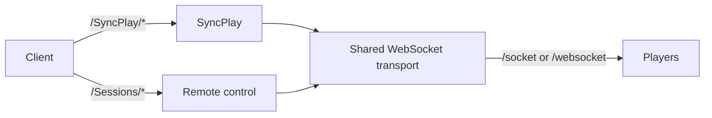

# Client sessions

This module gives SyncPlay and remote control one shared client identity and
WebSocket connection. Control stays in Jellyswarrm so clients can play media
from different backends without involving an upstream server in coordination.

The router sends `/SyncPlay/*` requests to the group coordinator and
`/Sessions/*` requests to remote control. Both reuse session authentication and
send commands through the same transport:

SyncPlay owns group state; remote control targets individual sessions. Remote
playback changes are rejected while a target is in a SyncPlay group.
Media streaming and playback reports still follow the existing upstream pipeline.

Rust tests in `tests.rs` check routing and isolation. The
[browser test](../../tests/browser/README.md) checks real two-client playback.
