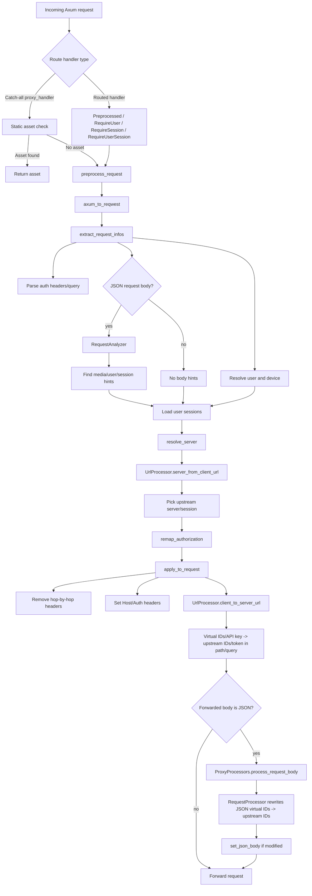
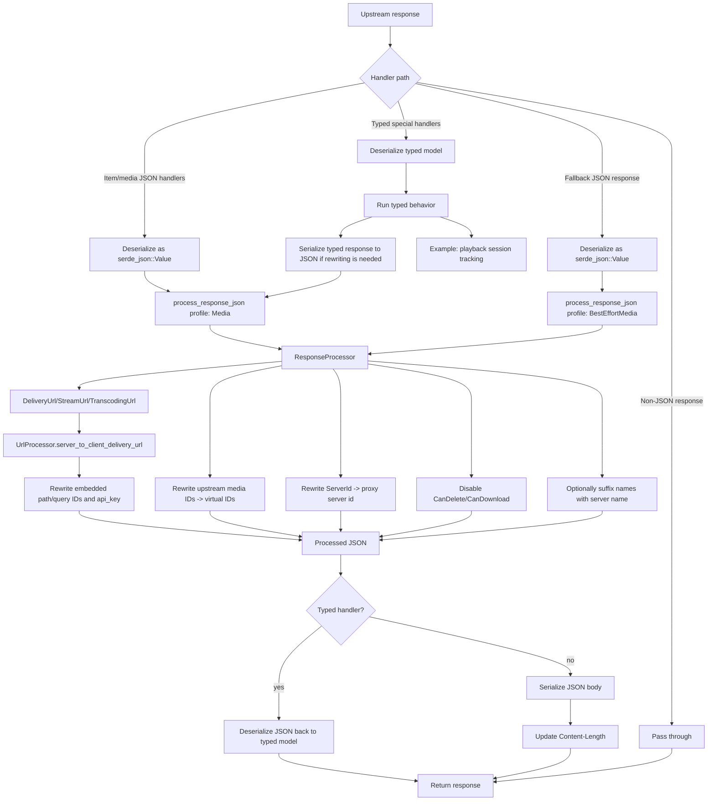

# Request and Response Processing

Jellyswarrm is a Jellyfin-aware reverse proxy. Clients see Jellyswarrm user IDs, media IDs, server IDs, and API keys. Upstream Jellyfin servers receive their original IDs and credentials.

The code keeps three concerns separate:

- Request preprocessing chooses the upstream server/session and rewrites the outgoing URL/auth.
- Request and response JSON processing rewrites IDs inside bodies.
- URL processing rewrites IDs and credentials in request URLs and embedded media delivery URLs.

Handlers should use the `extractors` module, `ProxyProcessors`, and `AppState::process_response_json` instead of calling low-level processors directly.

## Request Flow

## Response Flow

## Response Profiles

- `Media`: full media response rewriting for explicitly routed media/item/playback/federated handlers.
- `BestEffortMedia`: full media-like rewriting for catch-all JSON responses. This keeps less common Jellyfin endpoints working even when they are not explicitly routed.
- `Disabled`: no response rewriting.

`Media` and `BestEffortMedia` currently rewrite the same fields. The main difference is how they are selected: explicit handlers use `Media`; the generic fallback uses `BestEffortMedia`. Name suffixing is still controlled separately by `should_change_name` and config.

## Component Boundaries

- `extractors.rs`: Axum extractors that run preprocessing and optionally require a resolved user, session, or both.
- `request_preprocessing.rs`: request identity extraction, session lookup, server selection, auth remapping, and outgoing URL/header rewriting.
- `processors/url_processor.rs`: all path/query URL rewriting for client-to-server request URLs, server-to-client delivery URLs, and request server detection.
- `processors/request_analyzer.rs`: scans incoming JSON bodies for media IDs, user IDs, and session IDs that help pick the upstream server/session.
- `processors/request_processor.rs`: rewrites JSON request body IDs from Jellyswarrm virtual IDs to upstream Jellyfin IDs.
- `processors/response_processor.rs`: rewrites JSON response fields from upstream Jellyfin IDs to Jellyswarrm virtual IDs and delegates embedded URL rewriting to `UrlProcessor`.
- `processors/json_processor.rs`: generic recursive JSON walker used by analyzers and processors.
- `processors/field_matcher.rs`: centralized field-name groups for JSON rewrite rules.
- `ProxyProcessors`: facade that constructs and coordinates request, response, analyzer, and URL processors.

## Design Rules

- Prefer `serde_json::Value` for pass-through media/item responses so unknown Jellyfin schema changes are preserved.
- Keep typed models where the proxy performs behavior beyond simple transformation, such as playback session tracking and federated item interleaving.
- Keep URL rewriting centralized in `UrlProcessor`; request URL rules and embedded delivery URL rules should not drift.
- Keep handler signatures expressive: use `Preprocessed`, `RequireUser`, `RequireSession`, or `RequireUserSession` instead of manually calling `preprocess_request` in routed handlers.
