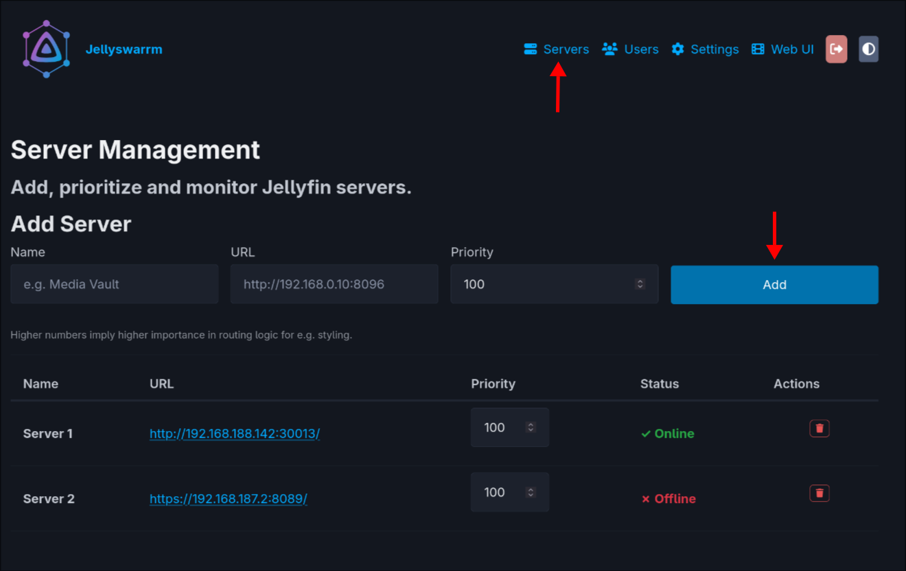
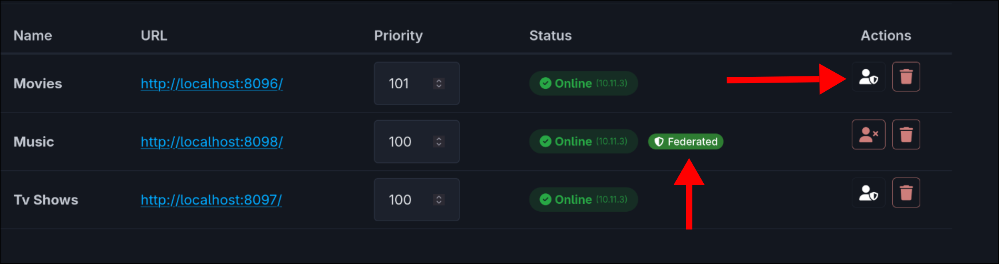
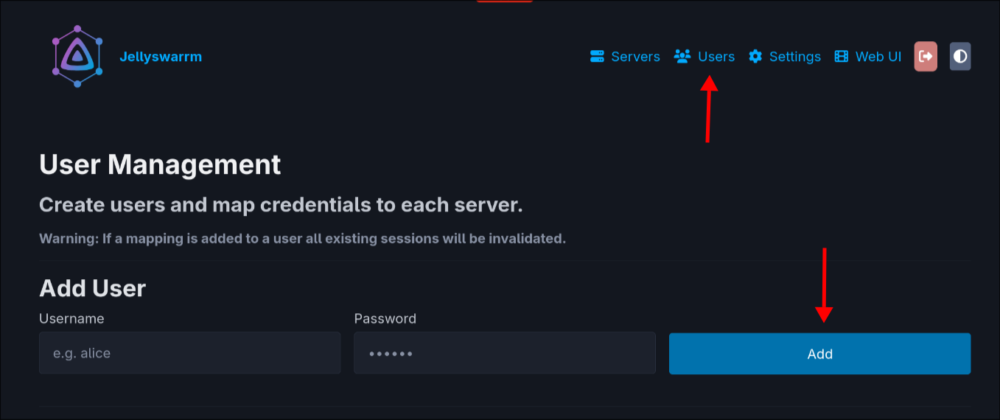
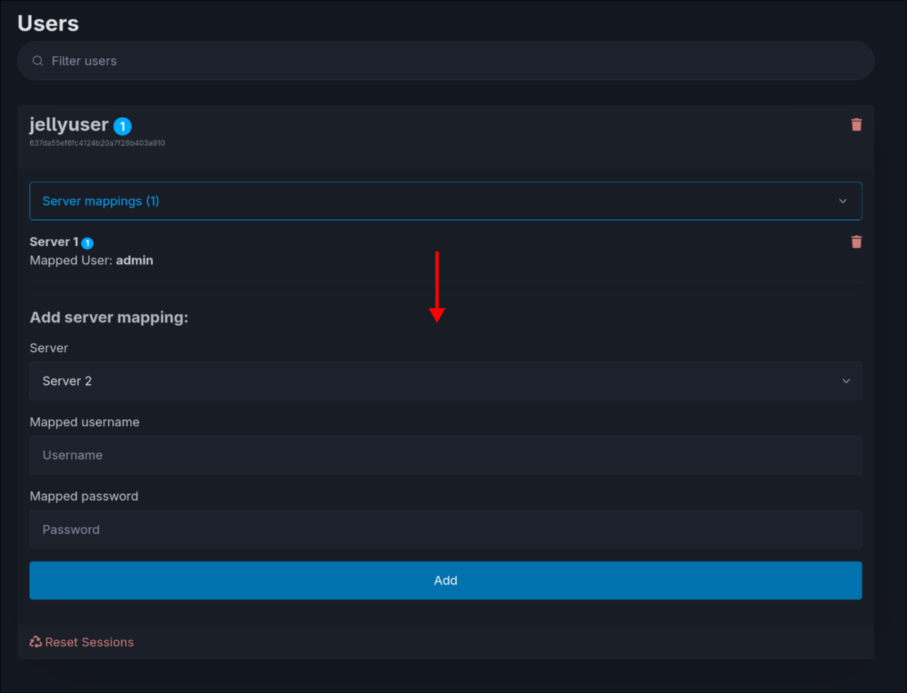
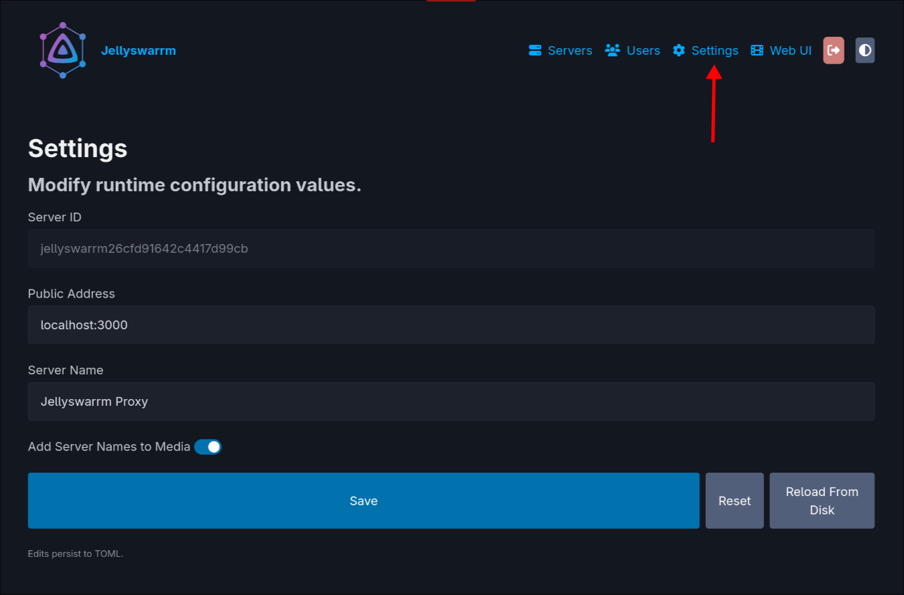

# Jellyswarrm UI Documentation

## Admin Interface Overview

The Admin Interface is displayed when you log in with an administrator account. It provides tools to manage connected Jellyfin servers, user accounts, and global settings for your Jellyswarrm instance.

### Adding Servers  

  

  

To connect your Jellyfin servers to Jellyswarrm, follow these steps:  

1. Open the Jellyswarrm Web UI in your browser:  
   `http://[JELLYSWARRM_HOST]:[JELLYSWARRM_PORT]/ui`  

2. Log in with the username and password you set in the environment variables during deployment.  

3. Go to the **Servers** section.  

4. Fill in the required details:  
   - **Server Name** – A friendly display name for the server.  
   - **Jellyfin URL** – The full URL to your Jellyfin server (e.g. `http://jellyfin.example.com`).  
   - **Priority** – Determines which server takes precedence for tasks not handled by the proxy (such as theming/styling). Higher numbers = higher priority.  

5. Click **Add** to save the server.  

To remove a server, simply click the **Delete** button next to the one you want to remove.  

#### Federarated Servers

  

After you add a server, you can optionally provide admin credentials. This allows Jellyswarrm to create and manage user accounts on that server automatically when using the federation features. Simply press the admin icon next to the server entry and enter the admin username and password for that Jellyfin instance.

### User Management & Federation

Jellyswarrm allows you to link users across multiple Jellyfin servers into a single unified account. This way, users can log in once and access media from all their connected servers seamlessly.

---

### Adding Users

#### Federation (Recommended)
When creating a new user in Jellyswarrm via the Admin UI, you can check the **Enable Federation** option.

  

This will automatically:
1. Create the user on all connected Jellyfin servers (requires Admin credentials to be configured for those servers).
2. Set the same password for all of them.
3. Automatically create the server mappings in Jellyswarrm.

This ensures that the user exists everywhere and is ready to use immediately without manual configuration.

#### Automatic Mapping (Login)
If a user already exists on one or more connected servers, they can log in directly with their existing Jellyfin credentials. Jellyswarrm will automatically create a local user and set up the necessary server mappings.

If the same username and password exist on multiple servers, Jellyswarrm will link those accounts together automatically. This provides a smooth experience, giving the user unified access to all linked servers.

#### Manual Creation
To manually create a user in Jellyswarrm without federation:

1. Open the Jellyswarrm Web UI in your browser:
   `http://[JELLYSWARRM_HOST]:[JELLYSWARRM_PORT]/ui`
2. Log in with the admin credentials you set during deployment.
3. Navigate to the **Users** section.
4. Define a **username** and **password** for the new user.
5. Uncheck **Enable Federation** if you only want to create the user locally in Jellyswarrm.
6. Click **Add** to create the user.

---

### Adding Server Mappings to a User

  

To manually link a user to additional server accounts (e.g. if they have different passwords or usernames on different servers):

1. In the **Users** section, find the user you want to extend with server mappings.
2. If the user does not yet have a mapping for a server, a dropdown menu will appear under their entry.
3. Select the target server from the dropdown.
4. Enter the **username** and **password** for the Jellyfin account on that server.
5. Click **Add** to save the mapping.

---

### Removing Users or Mappings

To remove a user or unlink a specific server mapping, simply press the **Delete** button next to the entry you want to remove.

When deleting a user, you can optionally choose to **Delete from all servers**, which will attempt to remove the user account from all connected Jellyfin instances where the admin has access.  

## Global Settings  

  

  

The **Settings** section lets you configure global options that affect how Jellyswarrm appears to your users and clients:  

- **Public Address** – The external address reported to Jellyfin clients.  
- **Server Name** – The display name shown to users when they log in.  
- **Add Server Name to Title** – When enabled, Jellyswarrm will append the server name to media titles in the format:  
  `Title [Server Name]`.  
